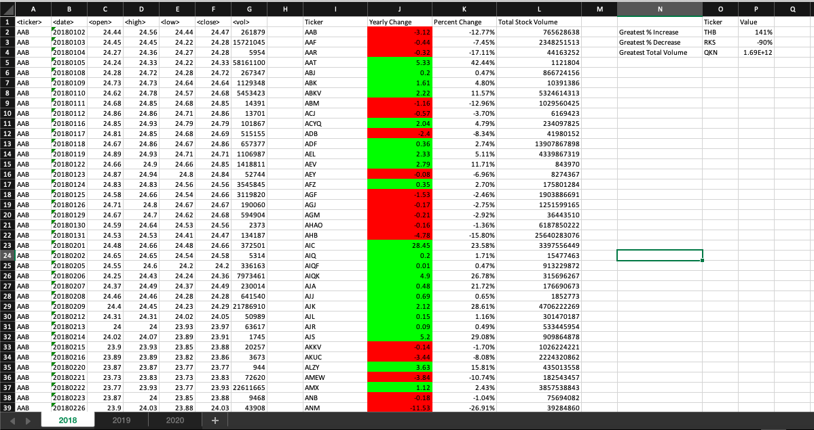
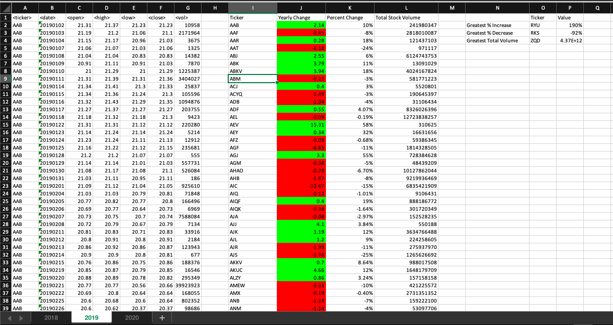
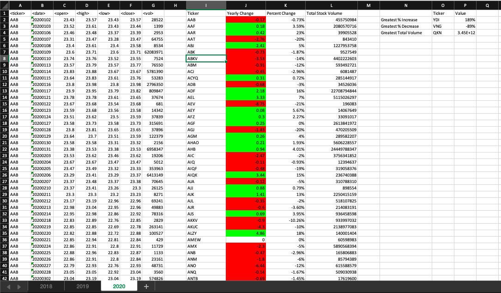

# VBA-Challenge
Module 2 assignment

Description
Let people know what your project can do specifically. Provide context and add a link to any reference visitors might be unfamiliar with. A list of Features or a Background subsection can also be added here. If there are alternatives to your project, this is a good place to list differentiating factors.

This project is to be run on a stock market data set in Excel. The VBA script will compile the entire data set into individual tickers, yearly change (per ticker) from the first opening price to the last opening price, percent change (per ticker) from the first opening price to the last closing price (with conditional formatting to color cells red or green for easy visualization), and total stock volume (per ticker). 

Additionally, the script ouputs the ticker with the greatest percentage of increase, the ticker with the greatest percentage of decrease, and the ticker with the greatest total stock volume. The superlative values associated with each ticker will also print.

This script is configured to run across all worksheets in the workbook. 

Installation
Excel file must be macro-enabled with developer option (in Excel ribbon tools) checked to run VBA script. 
